# Ropes4k

An implementation of a Rope data structure in Kotlin.

## Why use a Rope?

Ropes are much faster than Strings, Stringbuffers, or CharArrays for insert and delete operations.
When inserting or deleting, they don't copy the data meaning that the working data set size is much smaller.

## How much faster?

Really a lot, see the performance charts. These show comparitive performance
of Ropes, Strings and StringBuffers for a few operations. The numbers themselves
are not relevant, only the relative speeds. 

Inserts, Prepends, and Deletes are effectively hundreds of times faster.

## What's the downside?

Because Ropes are stored as trees, getting characters by index is slower, so random-access into Ropes is not the best access pattern.
In-Order and Reversed-Order iteration of Ropes is relatively efficient in this implementation.

## How to use?

A Rope implements the following interfaces:

 - CharSequence
 - Iterable<Char>
 - Comparable<CharSequence>
 - Serializable

Your code should refer to CharSequence wherever possible. If it does, then using a Rope
is as simple as:

```kotlin
val r = Rope.of("123")
```

If you have a `CharArray`, you can use `ofCopy` - This is to highlight that `CharArray`s are copied right now.

```kotlin
var r = Rope.ofCopy("123".toCharArray())
```


## Caveats

The Rope doesn't copy your `CharSequence`, but Ropes are supposed to be immutable, so if you modify the underlying `CharSequence`
undefined behaviour will happen.

The current implementation *does* copy a `CharArray` on construction, and option is planned later to make a zero-copy version.

## Performance

### net.ropes4k.test.bench.AppendBenchmark

Appending 500 subsequences of a 200kB charsequence to itself.

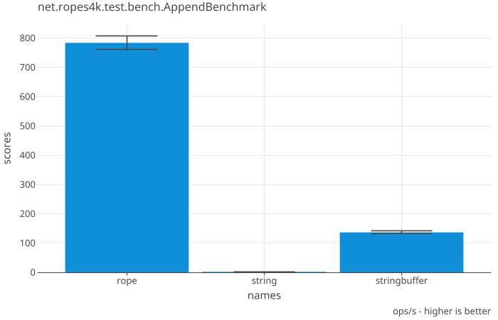


### net.ropes4k.test.bench.CreationBenchmark

Instantiating a 200kB instance. A Rope based on a CharSequence does no copy,
so it's way faster than the others, that all copy in some way.


### net.ropes4k.test.bench.DeleteBenchmark

Deleting 500 subsequences from an original 200kB.

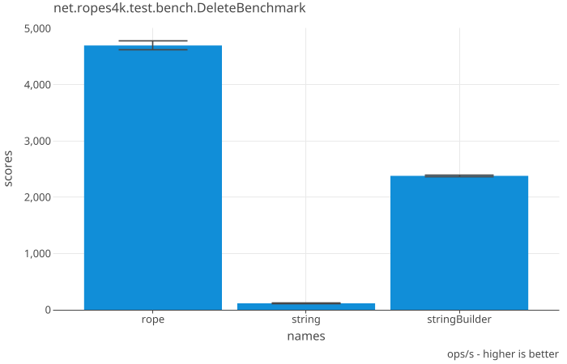


### net.ropes4k.test.bench.IndexBenchmark

Indexing into a 200kB char string.

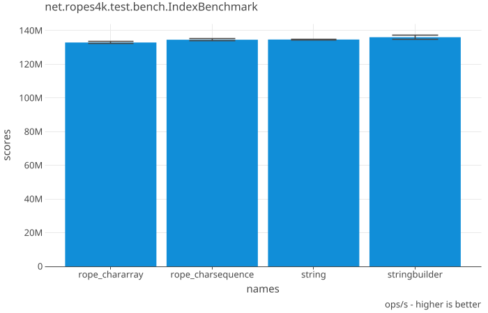


### net.ropes4k.test.bench.InsertBenchmark

Inserting subsequences of a rope into itself

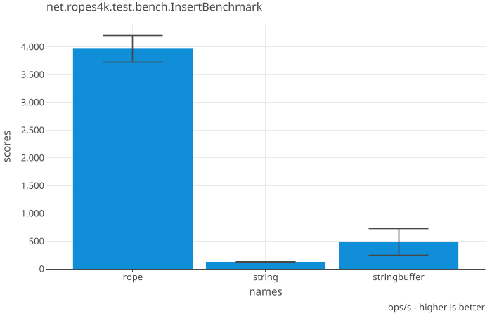


### net.ropes4k.test.bench.Insert2Benchmark

Inserting subsequences of a rope into a different rope

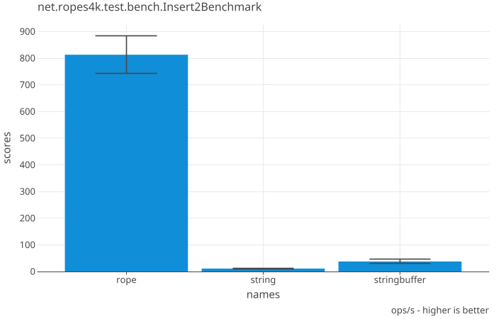


### net.ropes4k.test.bench.PrependBenchmark

Prepending 500 subsequences of a 200kB character string onto itself.

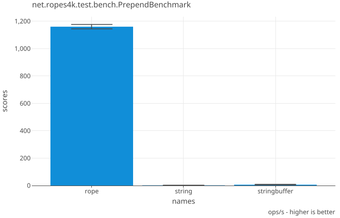


### net.ropes4k.test.bench.RegexComplexBenchmark

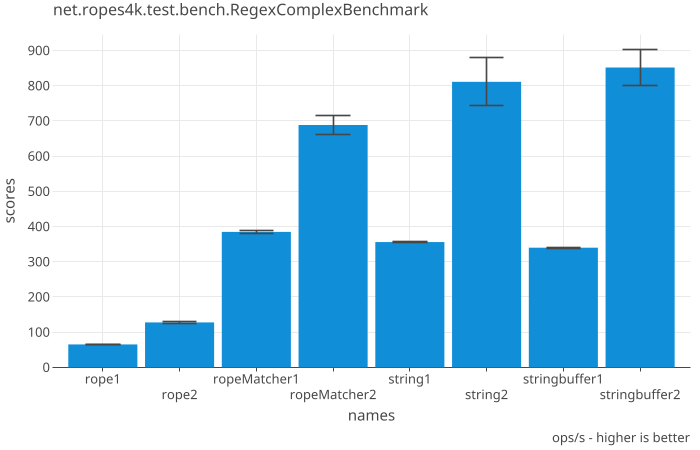


### net.ropes4k.test.bench.RegexSimpleBenchmark

Running simple regex against 200kB character string

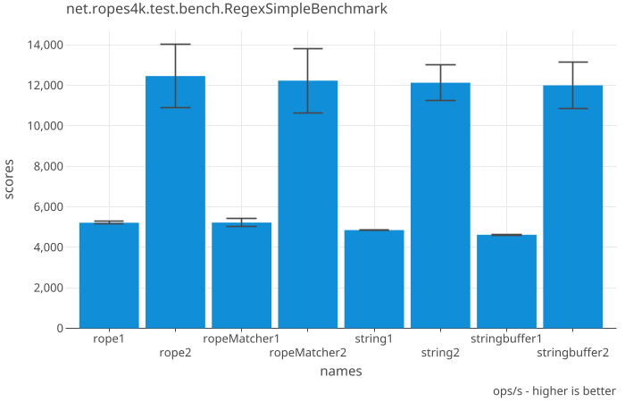


### net.ropes4k.test.bench.SearchSimpleBenchmark

Finding simple string in 200kB character string.

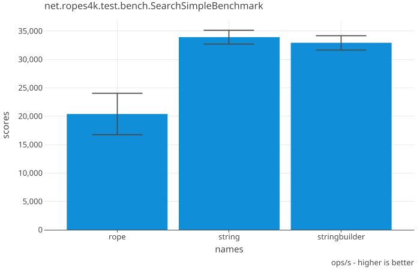


### net.ropes4k.test.bench.SearchComplexBenchmark
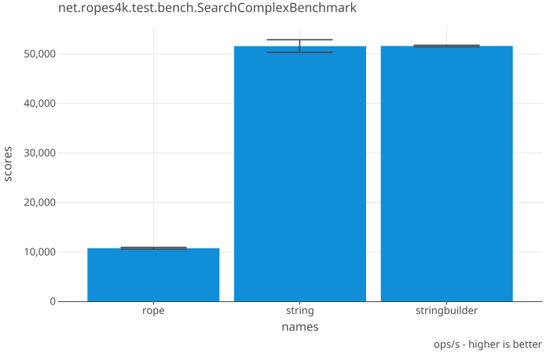


### net.ropes4k.test.bench.TraversalBenchmark

Iterating over 200kB character string

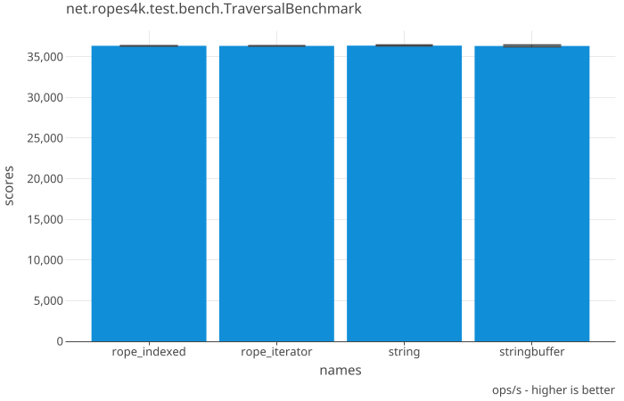


### net.ropes4k.test.bench.WriteComplexBenchmark
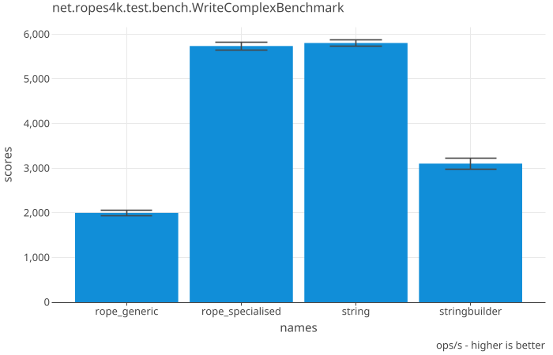


# Original Implementation

This version started off as [Ropes for Java](http://ahmadsoft.org/ropes/release.html) and the original code is GPL Licence

The original author of Ropes for Java was Amin Ahmad.

